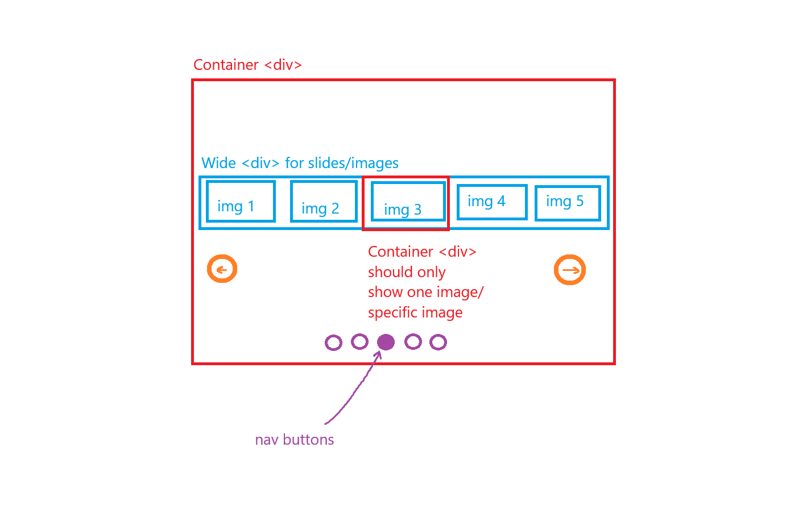

# Image carousel

This is the image carousel part of the "Dynamic User Interface" lesson.
I am to design an image carousel that automatically switches to the next 
image every 5 seconds. The transition between images does NOT need to 
be animated/smooth, it just needs to switch.

# features:

1. Contain arrows on each side to advance the image forwards
or backwards.

2. Should automatically move forward (to the right/advance)
every 5 seconds. 

3. Should have tiny navigation circles at the bottom 
to indicate current slide. The circles should be clickable 
to advance to the indicated slide.

4. Don't focus too much on image size, we just want the 
carousel to rotate images.

5. Just like it defined in the lesson, it recommends having 2
main div elements, one for containing the "slides" of the 
carousel with the images which is going to be inside the 
other div, which acts like the "picture frame" to visibly 
show which.

# Visual plan 

